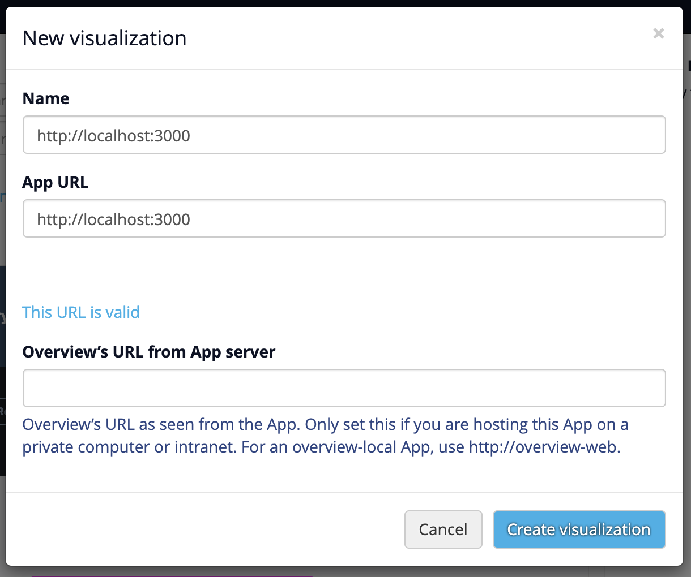

# LAT Keywords User Test Frontend AKA Associator

This is a front end app for LA Times keyword search plugin for overviewdocs.com called Associator. This project uses React/Typescript on the front end and flask for the backend deployed in aws.

```
NOTE: This plugin is meant to be used inside of a local instance of overviewdocs. Since overviewdocs.com require any plugin to have SSL. If you want to develop outside of overview, use `/show` at the end of the url. -> `localhost:3000/show`
```

## Technologies Used

- React (CRA)
- TypeScript
- React-Router
- Styled Components
- axios
- eslint
- prettier

## Local development

```bash
$ git clone https://github.com/mansiganatra/lat-keywords-user-test-frontend.git
$ cd lat-keywords-user-test-frontend
$ npm install
$ npm start
```

## Plugin instruction inside of [overview-server](https://github.com/overview/overview-server)

1. Upload a document set
2. Click on the document inside the dashboard
3. Click on "Add view"
4. inside Add view menu, click on "Custom..."
5. paste your server url inside "Name" and "App URL". Make sure you remove the ending `/` -> `http://localhost:3000` and click "Create visualization"
6. Plugin needs to be `https://` by default, click "use it anyway"

Outcome:



## Test

```bash
$ npm run test
```
